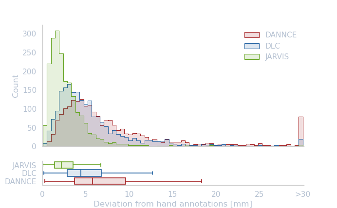

# JARVIS - Markerless 3D Motion Capture Toolbox

{ .off-glb }

JARVIS makes highly precise markerless 3D motion capture easy. All you need to get started is a multi camera recording setup and an idea of what you want to track.
Our Toolbox will assist you on every step along the way, from recording synchronised videos, to quickly and consistently annotating your data,
all the way to the final 3D pose predictions. 
If you are interested in setting up a 3D Motion Capture System or just want to learn more about our toolbox we strongly recommend having a look at our
[Getting Started Guide](../../getting_started/1_introduction) and our [Manual](../../manual/1_introduction). Here you'll find an overview of our workflow as well as tutorials to help you build a successful 3D tracking pipeline with JARVIS.

## Why JARVIS?
Markerlerss motion capture has become an essential data analysis tool in many fields of research, pioneered largely by [DeepLabCut](https://github.com/DeepLabCut/DeepLabCut) several years ago.
While there have been significant improvements to those methods both in terms of capabilities and usability, those advances mainly tackle single image based
2D tracking. Setting up a system for multi camera 3D motion capture on the other hand still remains very challenging and time consuming.\
JARVIS tries to change that by introducing an easy to use toolchain that was developed with highly precise 3D Tracking as the primary goal, not just an afterthought.

Our System consists of three parts:

- The **Acquisition Tool** allows you to record synchronized high resolution videos from multiple cameras at high frame rates thanks to GPU accelerated online compression. If you use one of the recommended cameras you can get your system setup and running with just a handful of clicks.
- The **Annotation Tool** leverages the multi camera recordings by projecting your manual annotations on a subset of those cameras to the remaining ones, significantly reducing the amount of tedious manual annotations needed. It also provides easy-to-use interfaces for calibrating your cameras
  and creating datasets.
- The **HybridNet Pytorch Library** is our state of the art 3D pose estimation architecture. The hybrid 2D/3D CNN architecture is faster to train and more precise than pure 3D CNNs and most importantly it can run on siginficantly smaller dataset sizes, saving you countless hours of mind numbing annotations while still achieving highly precise markerless motion capture - even in scenarios with heavy occlusion. 
 

  

    <b>Human Hand</b>
    
    <table id="info">
      <tr>
        <td>Annotated Frames</td>
        <td>10000</td>
      </tr>
      <tr>
        <td> Number of subjects</td>
        <td>4</td>
      </tr>
    </table>
  

  

    <b>Monkey Hand</b>
    
    <table id="info">
      <tr>
        <td>Annotated Frames</td>
        <td>3000</td>
      </tr>
      <tr>
        <td>Number of subjects</td>
        <td>1</td>
      </tr>
    </table>
  

  

    <b>Rat Full Body</b>
    
    <table id="info">
      <tr>
        <td>Annotated Frames</td>
        <td>2000</td>
      </tr>
      <tr>
        <td>Number of subjects</td>
        <td>1</td>
      </tr>
    </table>
  

  

    <b>Mouse Full Body</b>
    
    <table id="info">
      <tr>
        <td>Annotated Frames</td>
        <td>3000</td>
      </tr>
      <tr>
        <td>Number of subjects</td>
        <td>3</td#>
      </tr>
    </table>
  

 

Our model outperforms the other currently available methods when trained on our human hand tracking dataset. Below you can see the performance of our toolbox compared to the well established markerless tracking toolbox [DeepLabCut](https://github.com/DeepLabCut/DeepLabCut) (DLC) and the recently released [Dannce](https://github.com/spoonsso/dannce) 3D tracking toolbox:  

## Supported Cameras

As mentioned before to be able to take full advantage of our Acquisition Tool without any modifications you'll have to use one of our supported cameras. The table below shows all currently supported camera models, we'll try to expand this list in the near future!

<table id="info" width="100%">
  <tr>
    <th>Company</th>
    <th>Model Name</th>
  </tr>
  <tr>
    <td>FLIR</td>
    <td>Chameleon</td>
  </tr>
  <tr>
    <td>FLIR</td>
    <td>Blackfly S</td>
  </tr>  <tr>
      <td>FLIR</td>
      <td>Grasshopper</td>
    </tr>
</table>
