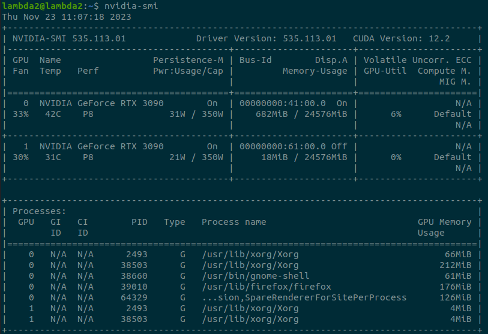
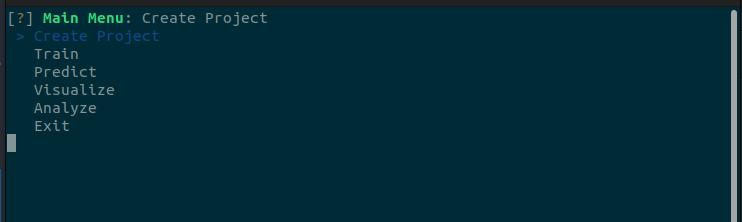

# Installation Guide

This covers the entire installation process for setting a Ubuntu 22.04 PC with all JARVIS Modules. Some of this might be mentioned in other parts of the Manual or the Getting Started Guide. You do **not** necessarily need to use Ubuntu 22.04 as your OS of course, but everything is developed and tested in Ubuntu, so chances of everything working out of the box are the highest this way!

# 1. Setting up Linux
 - Install **Ubuntu 22.04** (you can use **[This Guide](https://ubuntu.com/tutorials/install-ubuntu-desktop)**)
 - Install the **[Lambda Stack](https://lambdalabs.com/lambda-stack-deep-learning-software)** by openning a Terminal and running:
    ```
    wget -nv -O- https://lambdalabs.com/install-lambda-stack.sh | sh - sudo reboot
    ```
    This installs all Nvidia Drivers and other important dependencies. To test the install run this after the reboot: 
    ```
    nvidia-smi 
    ```
    The output should look like this:

    {: .center width="60%" }

    !!! warning "If there is an error like `Failed to comminicate with NVIDIA driver`, disable **secure boot** in the BIOS."

 - Install Miniconda by downloading the installer from **[here](https://docs.conda.io/projects/miniconda/en/latest/)** (Use `Miniconda3 Linux 64-bit`) and runnning
    ```
    sh Miniconda3-latest-Linux-x86_64.sh
    ```
    (If your installer is in your `Downloads` directory, make sure you also open your terminal in this directory)
 - Download FLIR Spinnaker (and Spinview) from their **[website](https://www.flir.eu/products/spinnaker-sdk/?vertical=machine+vision&segment=iis)** (Use the Linux AMD 64-bit version). Complete the entire install, changing the udev-rules and USBFS size are also **really** important for Jarvis to work correctly. To install extract the downloaded archive to your home directory and from inside it run
   ```
   sh install_spinnaker.sh
   ```
During the install you can always select **yes** if prompted. Restart the computer after the installation is complete for all the changes to take effect.


# 3. Setting up the AcquisitionTool
## Installation
- Go to the **[Github Repos Releases Page](https://github.com/JARVIS-MoCap/JARVIS-AcquisitionTool/releases)** and download the installer for your system from the most recent release
- Open a Terminal in the directory you downloaded the installer to and run
   ```
   sudo apt install ./JARVIS-AcquisitionTool_<VERSION>.deb 
   ```
   Replace version with the one you downloaded of course!
- You should now be able to launch the AcquisitionTool by running `AcquisitionTool` in a terminal from anywhere

## Setting up USB Cameras
Check that that USBFS size is set correctly by running
```
cat /sys/module/usbcore/parameters/usbfs_memory_mb
```
This should return `1000`. There is no further setup required for USB Cameras


## Setting up GigE Cameras and Network
### Network Switch
The exact way to configure your network switch depends on the barnd and model. 
!!! warning "Set `MTU` to ~9014"

### Network Setup on Computer
- Assign a fixed IP to all Ports on your Network Interface Card (NIC): `Settings -> Network -> Ethernet -> Gear Icon -> IPv4`:
   - Set IPv4 Method to `Manual`
   - Set Address to: `192.168.1.1` (192.168.1.2 for the second port etc.)
   - Set Netmask to `255.255.255.0`
- Setup Maximum Transfer Unit (`MTU`) for all network ports:
   - Go to `system-connections` directory using:
      ```
      cd /etc/NetworkManager/system-connections/
      ```
   - List all files in the directory using `ls`, there should be one file per port with names like `Wired connection 2.nmconnection`
   - Edit each of those files by running (replace X with actual number):
      ```
      sudo gedit Wired\ connection\ X.nmconnection
      ```
   - Below `[ethernet]` add the following line:
      ```
      mtu=9014
      ```
   - After this reboot the computer and run this to check if it is configured correctly:
      ```
      ifconfig | grep mtu
      ```

### Network Setup on Cameras
!!! warning "For the first steps it is essential that the cameras are connected to a network with access to a **DHCP server**"
- Open the Spinview Software (This step can **not<span style="color:#63a31f"> be done with JARVIS)
- For each camera that has a red exclamation mark, right click on it and assign a new IP using `Auto Force IP`
- Now the camera should be accessible from SpinView, double click the first one to select it
- For each camera:
   - Search for <span style="color:#63a31f">DHCP</span> -> uncheck checkmark
   - Search for <span style="color:#63a31f">Current IP configuration persistent IP</span> -> set checkmark
   - Search for <span style="color:#63a31f">Persistent IP Address</span> -> set to available address, e.g `192.168.1.2` (make sure this matches the IP of your network ports)
   - Search for <span style="color:#63a31f">Persistent Subnet Mask</span> -> `255.255.255.0`
- IP addresses need to be entered as plain integers, conversion works as follows for `192.168.1.2`
   ```
   ip_int = (196*256^3) + (168*256^2) + (1*256^1) + (2*256^0) 
   ```


- **Important:** Connect the camera to their final Switch/Network now. For each Camera:
   - Search for **Packet** and check that `Max. Packet Size` is **9000** and set `SCPS Packet Size` to **9000**. If `Max. Packet Size` is smaller there is an issue with your network configuration, go back to the two previous steps and make sure everything is set up correctly.

## Setting up the Arduino Trigger 
- Clone the **[JARVIS-TriggerFirmware Repository](https://github.com/JARVIS-MoCap/JARVIS-TriggerFirmware)** using:
   ```
   git clone --recursive https://github.com/JARVIS-MoCap/JARVIS-TriggerFirmware.git
   ```
- Setup the udev rules to be able to connect to the Arduino by running:
   ```
   curl -fsSL https://raw.githubusercontent.com/platformio/platformio-core/develop/platformio/assets/system/99-platformio-udev.rules | sudo tee /etc/udev/rules.d/99-platformio-udev.rules
   ```
- Navigate to the cloned Repository:
  ```
  cd JARVIS-TriggerFirmware
  ```
- Make sure your Arduino Uno is connected to one of the USB ports on your computer (a USB 2.0 port is sufficient here) and run
   ```
   sh install_arduino_uno.sh
   ```


## 4. Setting up the AnnotationTool
- Go to the **[Github Repos Releases Page](https://github.com/JARVIS-MoCap/JARVIS-AnnotationTool/releases)** and download the installer for your system from the most recent release
- Open a Terminal in the directory you downloaded the installer to and run
   ```
   sudo apt install ./JARVIS-AnnotationTool_<VERSION>.deb 
   ```
   Replace version with the one you downloaded of course!
- You should now be able to launch the AcquisitionTool by running `AnnotationTool` in a terminal from anywhere

## 5. Setting up the HyrbridNet Python Library
- Install git using:
  ```
  sudo apt install git
  ```
- Clone the **[HybridNet GitHub Repository](https://github.com/JARVIS-MoCap/JARVIS-HybridNet)** by running:
   ```
   git clone https://github.com/JARVIS-MoCap/JARVIS-HybridNet.git
   ```
- Navigate to the downloaded Repo with:
  ```
  cd JARVIS-HybridNet
  ```
- Create a `jarvis` Conda Environment by running:
  ```
  conda create -n jarvis python=3.9  pytorch=1.10.1 torchvision cudatoolkit=11.3 notebook  -c pytorch
  ```
- Activate the environment by running:
  ```
  conda activate jarvis
  ```
- Make sure the right `SetupTools` version is installed with:
  ```
  pip install -U setuptools==59.5.0
  ```
- Install the `jarvis` package with:
  ```
  pip install -e .
  ```
- You should now be able to run the jarvis Command-Line-Inerface (CLI) with:
  ```
  jarvis launch-cli
  ```
  You should see this in your terminal:
  {: .center width="70%" }


- To update Jarvis run
  ```
  git pull
  ```
  from inside the `JARVIS-HybridNet` directory.