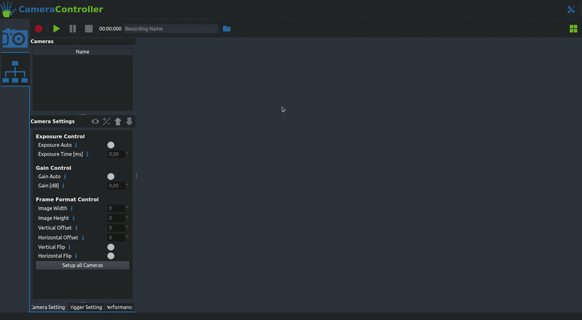
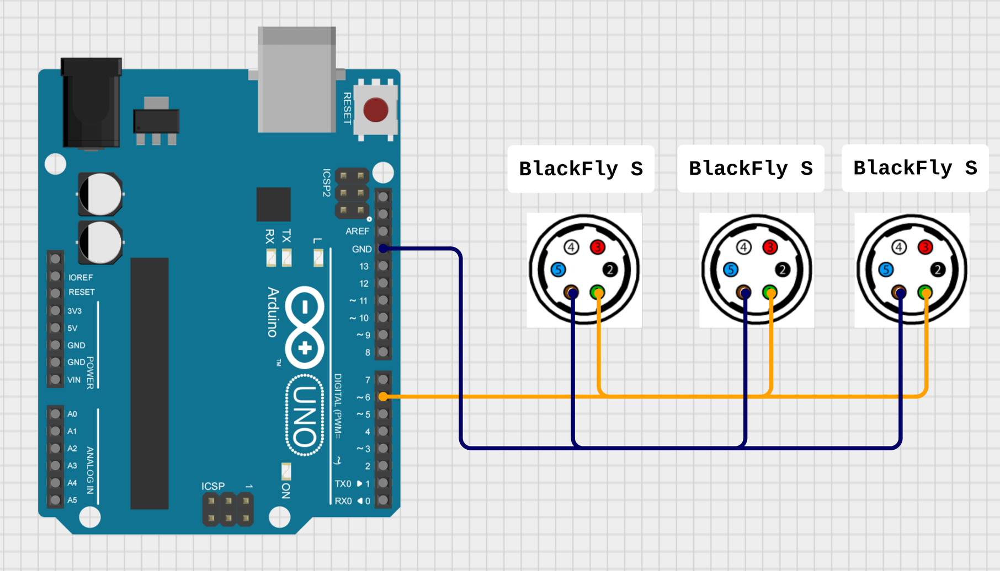
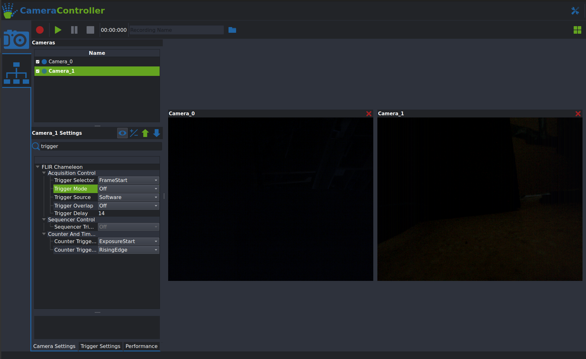
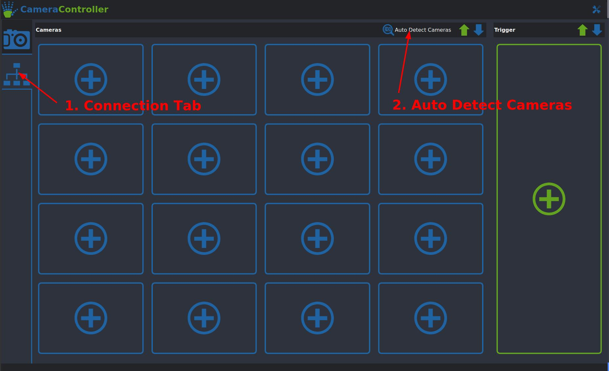

# Setting up the AcquisitionTool

{: .center .rounded width="80%" }


With the basic setup design out of the way, the next challenge to tackle is getting all your cameras to record synchronized videos for you. Our AcquisitionTool makes this process very easy for all [FLIR machine vision cameras](https://www.flir.eu/browse/industrial/machine-vision-cameras/modelselector/).

## 1. Hardware Requirements

- <span style="color:#63a31f">**A set of FLIR cameras:**</span> We recommend the BlackFly S model, but choose whatever fits your application best.
- <span style="color:#63a31f">**Matching GPIO cables:**</span> Those are required to hook up the external trigger, you can order them with your cameras on the FLIR website.
- <span style="color:#63a31f">**An Arduino Uno (or similar):**</span> This will be used as the source of the external trigger (And as a way to control and monitor your setup in future releases).
- <span style="color:#63a31f">**A recording computer**</span> with the following specs:
- <span style="color:#63a31f">**A proper lighting solution:**</span> This one really depends on your setup, so we can't give any exact recommendations. But make sure you don't forget to take proper lighting into account when designing your setup. The most important factors here are even illumination from all sides and overall brightness.

    * **A recent Nvidia GPU:** 10xx, 20xx and 30xx series cards will work. If you are using more eight cameras or more we recommend at least a 2080 or preferably a 30-series card.
    * **A decent CPU** Our tool offloads most of the work to the GPU, a modern Intel i7 or equivalent is strongly recommended.
    * **A fast SSD** Even with compression you are still writing a lot of data. We recommend SSDs with a write speed of at least 3000 MB/s.
    * **Enough USB Ports:** Make sure you have enough available USB3 ports if you are using USB cameras. FLIR sells some suitable [USB Host Controller Cards](https://www.flir.eu/products/usb-3.1-host-controller-card/). 
    !!! warning "Be aware of USB bandwidth sharing when using motherboard usb ports"
        <span style="color:#bb6d24">**Caution:**</span> Some USB ports on your computer can share their bandwidth, which will cause issues if you are recording at high resolutions. You can check that in the spec sheet of your motherboard or the **Hardware check** tab in the **AcquisitionTool Settings**.


## 2. Software Installation

The first thing you will have to do is install the **FLIR Spinnaker SDK**. You can download it [here](https://www.flir.eu/products/spinnaker-sdk/). If you are running Windows make sure to download the '\*_x64.exe' found in the 'Latest Spinnaker Full SDK' directory. For Linux the '\*amd64-pkg.tar.gz' is the package you want.<br>
Once that is installed you can grab the [AcquisitionTool Installer](../../downloads/downloads) from the Downloads section. Under Windows just run the installer and follow the instructions. Under Linux you can install the AcquisitionTool by running
```
sudo apt install ./JARVIS-AcquisitionTool_1.0-1_amd64_2004.deb
```
(Make sure to replace the version numbers with the version you downloaded).

If the installation completed successfully the AcquisitionTool should now be available in your Start menu under Windows. If you are running Linux you can open it by typing `AcquisitionTool` into a terminal and pressing enter.

This is a good time to test out if everything is working as intended, before we move on to setting up synchronization with the external trigger.<br>
For a quick test connect at least one or two cameras to your computer, launch the AcquisitionTool and navigate to the Connection mode as shown below. You can now either connect each camera individually by clicking one of the  slots or simply detect all cameras with the <span style="color:#63a31f">**Auto Detect Cameras**</span> button. If that works you can then switch back to the Acquisition Mode. If your cameras are in their default mode you should be able to get them streaming by clicking the   button in the top left corner. If you now see live images of what all your cameras are seeing you are set to move on to the next and final setup step for the AcquisitionTool.

{: .center .rounded width="90%" }

??? info "Troubleshooting and Hints"

    1. **Cameras not connecting:** If your cameras do not show up after clicking the Auto Detect button there's a couple of things you can do:
        
        - Make sure your camera is plugged into a (not shared) USB3 port (Usually the ones with the blue plastic part).
        - Check whether you are able to access them in SpinView. If that also fails try reinstalling the Spinnaker drivers.
        - Linux only: Make sure you did setup the group permissions and the USB buffer size correctly.

    2. **Cameras not streaming:** If any of your cameras are not showing an image after you start streaming this is very likely due to them being set up in a non standard acquisition mode. To make sure they have their default settings loaded you can follow the these steps:

        - Select a camera by double clicking its name in the list in the top left corner
        - Click the   arrow in the top right corner of the 'Camera Settings' Tab. This should open up the presets menu.
        - In the menu select the 'Default' UserSet by clicking on it and press 'Load'.
        - Try streaming again by clicking the green  button, it should now work for the camera you selected.
        - Repeat those steps for all cameras that are not showing an image.

    3. **Building the Tool from source:** If you are planning on using the AcquisitionTool on a different Linux distribution or are interested in modifying the source code check out the **[GitHub Repo](https://github.com/JARVIS-MoCap/JARVIS-AcquisitionTool)**! It has detailed instructions on how to build the tool and its dependencies yourself.


## 3. Setting up the External Trigger

At this point you should have a recording setup that can be controlled using our AcquisitonTool and can stream video from all of your cameras. The last but very important step that is still missing is making sure all cameras record their videos perfectly in sync. To do this we use an external trigger pulse supplied by an [Arduino Uno](https://store.arduino.cc/products/arduino-uno-rev3) (or similar, our PlatformIO project supports many of the commonly used Microcontrollers).

#### Programming the Arduino
Programming the Arduino is really easy thanks to our PlatformIO install scripts for both Linux and Windows. Simply do the following:

=== "Linux"
    - Clone our [TriggerFirmware Repository](https://github.com/JARVIS-MoCap/JARVIS-TriggerFirmware) from GitHub with:
    ```
    git clone --recursive https://github.com/JARVIS-MoCap/JARVIS-TriggerFirmware.git
    ```

    - Change into the TriggerFirmware directory and execute the install script:
    ```
    cd JARVIS-TriggerFirmware && sh install_arduino_uno.sh
    ```

=== "Windows"
    - Make sure you have a recent version of Python installed. You can either get it directly from the Microsoft Store or download it from [here](https://www.python.org/downloads/).
    - Clone our [TriggerFirmware Repository](https://github.com/JARVIS-MoCap/JARVIS-TriggerFirmware) from GitHub with:
    ```
    git clone --recursive https://github.com/JARVIS-MoCap/JARVIS-TriggerFirmware.git
    ```
    !!! warning "Do not use the `Download ZIP` option on GitHub"
        GitHub does not include all neccessary submodules in its .zip download. If you don't have git installed on your computer you can click **[here](https://github.com/JARVIS-MoCap/JARVIS-TriggerFirmware/releases/download/v0.1/JARVIS-TriggerFirmware.zip)** to download a .zip folder containing all the necessary data.

    - Change into the TriggerFirmware directory and execute the installer batch file:
    ```
    .\install_arduino_uno.bat
    ```
    - If the install throws an error related to `Long Path Support` first remove the `JARVIS-TriggerFirmware\PlatformIO\install` directory and then open a command prompt as administrator and run:
    ```
    reg add "HKLM\SYSTEM\CurrentControlSet\Control\FileSystem" /v LongPathsEnabled /t REG_DWORD /d 1
    ```

#### Wiring up the Arduino

Now comes the slightly tricky part. wiring up all the trigger cables. The exact connections you have to make depend on your exact camera model, but the general idea is always the same:

- Connect the ground (GND) pins of all cameras to one of the pins on the Arduino labeled GND.  
- Connect the trigger input (check your cameras datasheet) pin of all cameras to pin 6 of your Arduino.

For more details on how to hook up your specific camera [this guide](https://www.flir.eu/support-center/iis/machine-vision/application-note/configuring-synchronized-capture-with-multiple-cameras/) from FLIR might be helpful. Here is a very basic wiring diagram for the FLIR BlackFly S:

{: .center .rounded width="70%" }


Once your Arduino trigger system is all wired up you can go back to the AcquisitionTool and connect the trigger using the  button. To make the cameras use the trigger signal there are a few settings you will have to change on each camera. Again, the exact settings might vary slightly depending on your camera model. This guide shows the settings for the BlackFly S, check FLIRs documentation on your camera model if those settings don't work. Here's the step-by-step guide:

1. Select a camera by double clicking its name in the list in the top left corner
2. Make sure the cameras default settings are loaded:

    - Click the  arrow in the top right corner of the 'Camera Settings' Tab. This should open up the presets menu.
    - In the menu select the 'Default' UserSet by clicking on it and press 'Load'.

3. Click the  button to get access to all settings.
4. Here's all the settings you will have to change:

    - **Trigger Mode:** On
    - **Trigger Source:** Line3
    - **Trigger Overlap:** ReadOut
    - **Pixel Format:** BayerRG8
    - **Exposure Auto:** Off
    - **Exposure Time:** Needs to be shorter than the time between your frames (At 100 FPS the limit is 10 ms). Caution: The value is set in microseconds!

With all those settings adjusted you should now be able to record synchronized videos! To be sure it's best to do a test recording and checking if all videos have exactly the same length.


## 4.AcquisitionTool Overview
The following will describe how to test and configure a multi-camera setup using the AcquisitionTool, these steps are identical for USB and GigE cameras. Here's a quick overview of main the interface:

{: .center .rounded width="70%" }


- The camera list on the upper left corner lists all connected cameras and lets you toggle between them
- The control panel on the lower left side gives you acces to each cameras settings. You can select the active camera by double clicking the camera in the list above.
    
    !!! warning "Settings are applied only to the active camera, the only way to change settings on all cameras simultanously is the <span style="color:#63a31f">Setup all Cameras</span> button."

- The button with the  icon lets you switch between the basic settings and all available settings.
- Saving and loading <span style="color:#63a31f">Presets</span> to the cameras is done using the  (for saving) and  (for loading) buttons. Only <span style="color:#63a31f">UserSet0</span> and <span style="color:#63a31f">UserSet1</span> can be overwritten, <span style="color:#63a31f">Default</span> loads the factory settings of the camera. 
- The control panel has two more tabs:
  - <span style="color:#63a31f">Trigger Settings</span>: This tab contains the settings for the external trigger. The only one that's relevant for most usecases is the <span style="color:#63a31f">FrameRate (FPS)</span>, which sets the frame rate in Frames Per Second.
  - <span style="color:#63a31f">Performance</span>: Shows the buffer useage and latency of each camera. The buffer useage bar should always be green and ideally not moving. The latency (enabled by clicking the  button) should be lower than the intervall between captured frames. (Example: at 100 FPS the intervall between frames is 1000ms/100 = 10ms).

## 1. Connect Cameras and save Setup Configuration
- Launch the AcquisitionTool by running `AcquisitionTool` in a terminal
- Make sure your cameras are connected to your PC, the indicator LEDs on the cameras should be flashing in green at this point
- Switch to the connection Tab and click the <span style="color:#63a31f">**Auto Detect Cameras**</span>  button.
    {: .center .rounded width="70%" }
- You can change the name of each camera by double clicking the name field (the defaults are Camera_0 to Camera_N). **Important**: Do not use the "-" character in the camera names!
- Click the  button next to the <span style="color:#63a31f">**Auto Detect Cameras**</span>  button to save the camera configuration (this includes which cameras are connected and their names) as a Preset. 
- Presets can be loaded using the `blue Arrow`
- Make sure your Arduino with the `TriggerFirmware` installed (see [this Section](1.Setup.html#setting-up-the-arduino-trigger)) is connected to a USB port on the computer and click the `green Plus` on the right to attach it to the AcquisitionTool. It will usually show up with a Device Name of `0043`, but it might be different.
- **Important**: Make sure that all connected devices show `Ready...` as their status! It is expected for the Trigger to show `Error...` for a few seconds when connecting.
  
## 2. Configuring the Cameras for use with the external Trigger
- Switch back to the `Camera` tab in the toolbar on the left edge of the window. You should see all your cameras in the list in the upper left corner.
- Click the `Setup All Cameras` button in the control panel. Leave both options under `General` checked and set the `Exposure Time` and `Gain` to suitable values. **Important:** Automatic Exposure is not recommended, as long exposure times can cause issues with the external Trigger.
- Verify that all cameras are setup correctly, the key settings to check are the following:
  - `Trigger Mode -> On`
  - `Trigger Source -> Line3`
  - `Trigger Overlap -> Readout`
  - `Pixel Fromat -> BayerRG8`
- After verifying the settings of each camera you can save them as a Preset (e.g. UserSet0), using the `green Arrow` button.
- Set `UserSet0` as the UserSet to be loaded on powerup using the `blue Arrow` button
- Try out your configuration by clicking the `green Play` button to start streaming from your cameras. This will not save any videos! Check that all cameras are working and no errors appear in the camera list. To stop streaming click the `red Stop` button. Make sure to select an appropriate Frame Rate for your cameras before streaming or recording!
- **Important:** If you experience any issues at this stage here are some things to check: 
  - For **GigE** cameras only: Confirm that the `Max. Packet Size` is set to `9000` and that your Switch as well as Network Interface Card have sufficient bandwidth. (E.g. not more than 10 cameras on a single 10 Gigabit connection).
  - For **USB3** cameras only: Make sure the USB Host Controller Card and/or the Motherboard USB ports you are using have sufficient bandwidth. You can check this by opening the `Settings` in the top right corner of the window, switching to the `Hardware Check` tab and running 'Check System':
  
    

  - For **USB3** cameras only: Check that your USB-FS buffer size is set correctly by running:
    ```
    cat /sys/module/usbcore/parameters/usbfs_memory_mb
    ```
    This should return `1000`. If not you can temporarily increase it by running:
    ```
    echo 1000 > /sys/module/usbcore/parameters/usbfs_memory_mb
    ```
    If this fixes it run the `configure_usbfs.sh` that is located in your FLIR Spinnaker install directory.

## 3. Record some Videos
To test the video recording functionality of the system follow these steps:
- Make sure your external trigger is connected and everything is set up as described in the previous section
- Click the `blue Folder` icon in the top bar and select a directory to store your recording in. **Important:** Make sure that the directory is on a SSD with fast write speeds (> 2500MB/s).
- Give the recording a unique name, if you leave this field blank the name will be "Recording_{Timestamp}".
- Click the `red Circle` recording button to start the recording. You should see a live preview of all camera perspectives. Leave this running for a short amount of time and stop the recoding using the `red Stop` button.
- Navigate to the directory you selected earlier and check that all cameras have recorded videos and you can play them back.
- Open the `metadata.csv` file and check that the `frame_id` field contains the same number (+- 2 frames is okay here, this does not mean that the videos are out of sync, but there is a slight issue with the metadata file writer getting closed a little too early)
- To compress the videos further after recording, you can use the following FFMPEG command for each cameras video file:
  ```
  ffmpeg -i Camera_T.avi -c:v libx265 -crf 12 -preset superfast -tag:v hvc1 Camera_T.mp4
  ```
  Obviously replace "Camera_T.*" with your actualy camera name. 