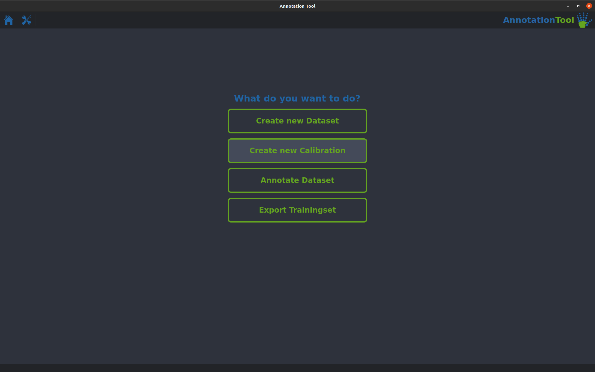
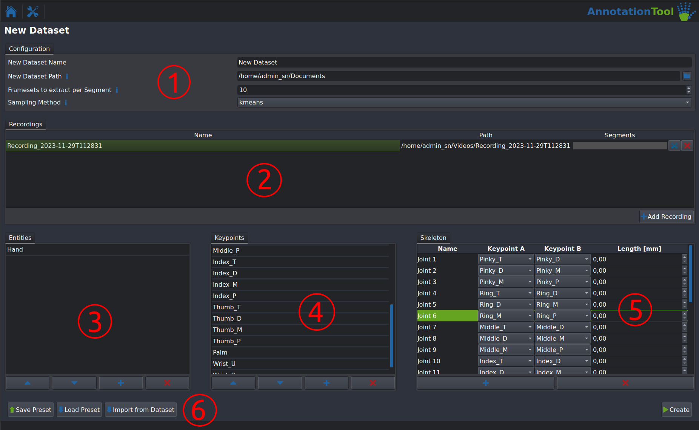
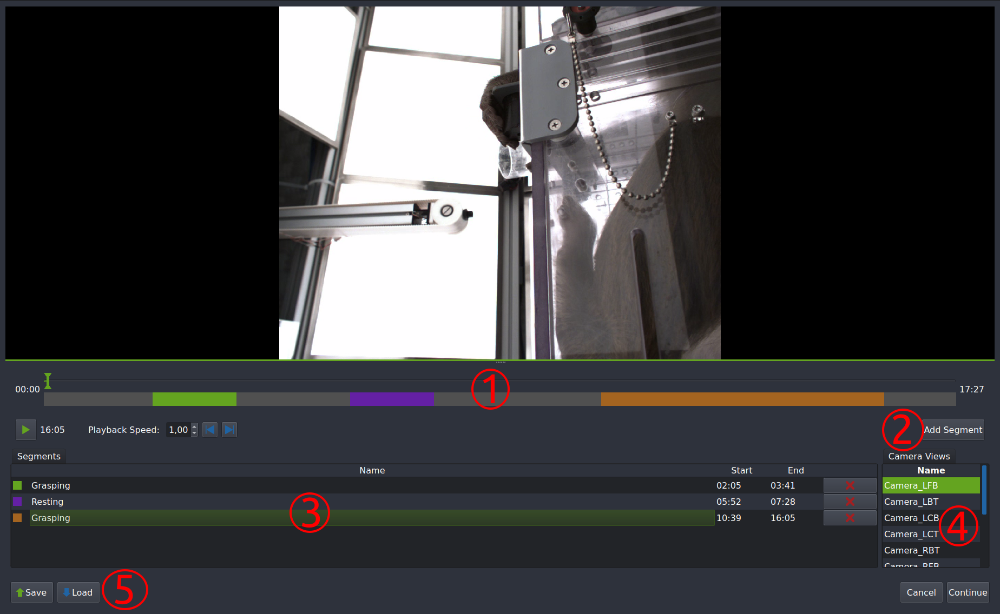
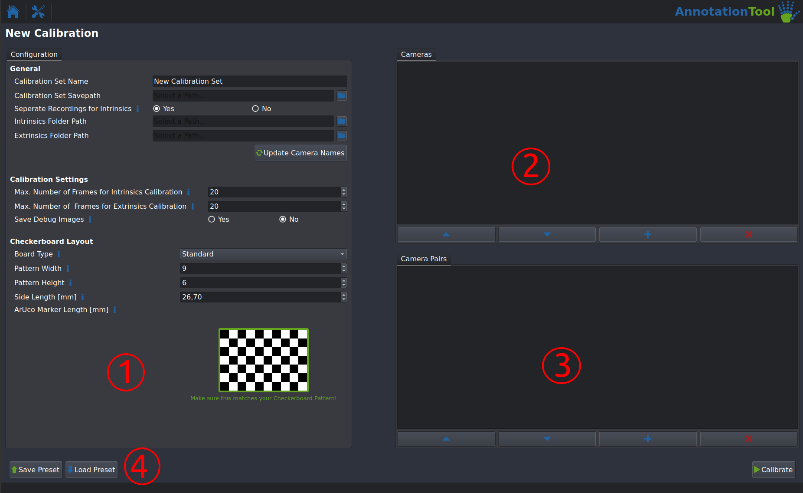
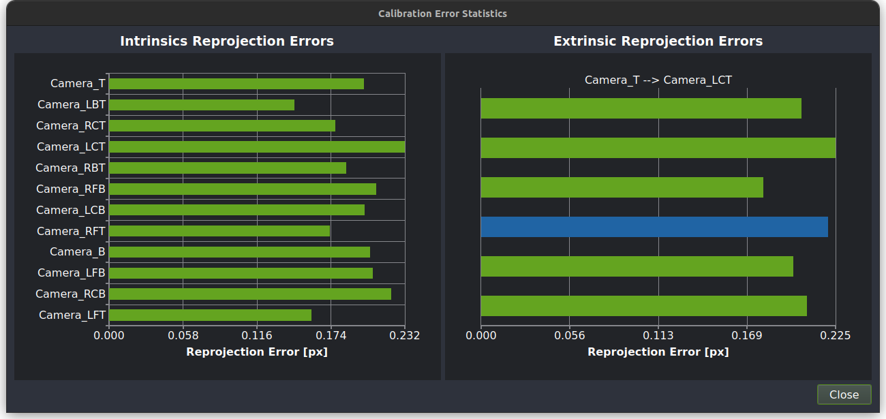
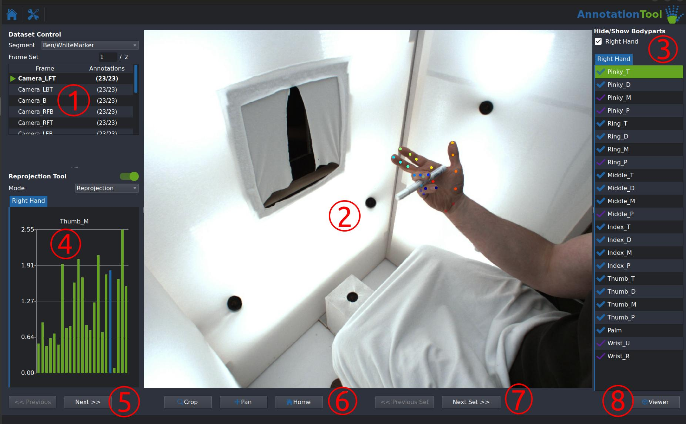
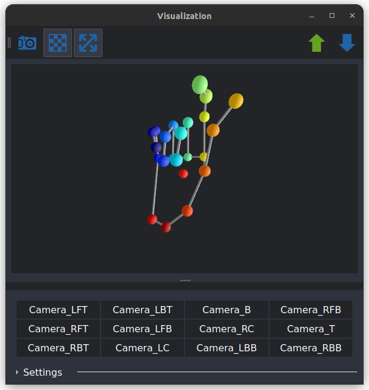
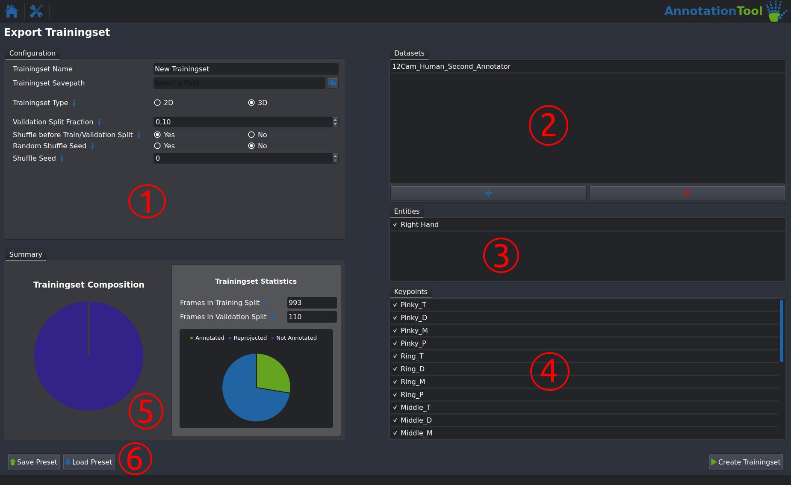

# Creating and Labeling Datasets
The AnnotationTool lets you create Datasets from your recordings, calibrate your cameras, annotate your Datasets, and finally export Trainingsets for training the HybridNet!

{: .center width="60%"}

The following will show you how to use all parts of the **AnnotationTool**. There are four main functions:

- Create new Dataset: This lets you create Datasets from AcquisitionTool Recordings. This is also where you will define the Keypoints and Skeleton you want to annotate.
- Create new Calibration: This lets you create a set of calibration parameters from a set of checkerboard recordings
- Annotate Dataset: This lets you load and annotate a dataset
- Export Trainingset: Once you are finished annotating a dataset this lets you export it as a Trainingset, the format used by the HybridNet Pytorch module.

## Create new Dataset

{: .center width="60%"}

- **(1)**: Configuration for the Dataset to be created:
  - New Dataset Name: Name of the dataset to be created. A directory with the same name will be created
  - New Dataset Path: Path where the new directory for the dataset will be created. This should **not** include the new datasets name!
  - Framesets to extract per Segment: Number of FrameSets to be created per Segment (See **(2)** details about Segments). One FrameSet is a set of images from **all** cameras, this is not the number of images! The total number of FrameSets extracted per recording should not exceed 100 unless it is a very long recording.
  - Sampling Method: Method used to extract the dataset. Select kmeans for high dataset quality and uniform for extraction speed. uniform is only recommended for quick test runs, not final datasets.
- **(2)**: Module to add Recordings to the dataset and define Segments within them.
  - The Add Recording Button lets you add a directory containing multi-camera recordings. The directory name will be used as the name of the recording, the filenames of the videos will be used as the camera names. Only add recordings with identical camera configurations and calibrations here!
  - Click the Scissors button to open the Segmentation Module for a recording (see **[section below](#segmentation-module)** for more details)
- **(3)**: Entities Input - This is a future-prrofing feature for potential multi-entity tracking capabilites. Simply add a single entity (e.g. "Monkey", or "Hand") here using the Add button.
- **(4)**: Keypoint Input - Add the names of all the keypoints you want to label here using the Add button (e.g. "Right Elbow", "Right Wrist" etc.). You can change the order of the keypoints using the arrow buttons. The order will be used in all subsequent steps.
- **(5)**: Skeleton Input - This step is optional! Add a skeleton connection and it's measured length (e.g. "Right Lower Arm", connecting the "Right Elbow" and "Right Wrist" keypoints). This will be used for visualization purposes as well as for showing the deviation between the measured lengths and the ones calculated for each FrameSet.
- **(6)**: Save and load Presets using these buttons. This is **highly** recommended, to make sure no typos ruin the compatability between two datasets with the same Keypoint configuration. A Hand and Rodent Body preset are provided. You can also import a configuration from a already existing dataset. 

## Segmentation Module
The Segmenation Module allows you to define which parts of a recording will be used to create the dataset to be labeled. This is a critical step in cases where there are long phases of inactivity between the relevant activities (e.g. long resting phases between grasps in our monkey experiments). As mentioned above an equal number of FrameSets is extracted for each segment. 

!!! warning "Segments with the same name are treated as one disjunct segment!"

{: .center width="60%"}

- **(1)**: Editor Timeline - Scrub through the video using the green cursor, zoom in and out using your mouse wheel and drag the gray bar to get to different parts of the video. 
- **(2)**: Click this button to add a segment. The segment will show up in **(3)** and a blue `Range Cursor` will appear in the timeline. Drag it around to select start and endpoint of the video and click `Add` to finalize the segment.
- **(3)**: Segments list - Doule click a segment to change it's name or delete it using the red X button. Segments with identical names will be treated as one disjunct segment.
- **(4)**: Double click a camera to change the view displayed in the editor.
- **(5)**: Save and load segmentations as `.csv` files. This is strongly recommended as redoing a segmenation can be a lot of work. Also save periodically to avoid dataloss in case of any crashes.
- Click continue once you are happy with your segmenation, your segmenation should be displayed next to your recording now.

## Create new Calibration
This module lets you create calibration parameters (in the form of `.yaml` files) from a set of calibration recordings. For more information on camera calibration in general, the [OpenCV Documentation](https://docs.opencv.org/4.x/dc/dbb/tutorial_py_calibration.html) is a good start. Check out [this Section]() for instructions on how to record calibration videos

{: .center width="60%"}

- **(1)**: Configuration:

    - **General**:
          - Calibration Set Name: Select the name of your new set of calibration parameters. This will be the name of the directory they are stored in.
          - Calibration Set Savepath: Path where the new directory will be created.
          - Seperate Recodrings for Intrinsics: Select wether you have seperate recordings for the intrinsic parameter calibration. If you do the format should be the following: One directory containing one video per camera, the filename has to be identical to the name of the camera. If you select "No" the Extrinisics recordings will be used for intrinsics calibration, this is generally **not** recommended.
          - Intrinsics Folder Path and Extrinsics Folder Path are the path to the the intrinsics and extrensics recordings mentioned above. See the Examples folder for example calibration recordings.
          - Update Camera Names: Click this after configuring all parameters in the General section. This will automatically detect all you Cameras and available Camera Pairs. **Important**: This will include all possible Camera Pairs, make sure you modify them as described in section **(3)** below!
    - **Calibration Settings**:
          - Max. Number of Frames for Intrinsics/Extrinsics Calibration should generally be left at the default value
          - 'Save Debug Images' saves images of all detected Checkerboards in a Debug folder along with your calibration parameters. This is very usefull for debugging a bad calibration.
    - **Checkerboard Layout**: 
          - Board Type: Select wether you are using a normal checkerboard (Standard) or a ChArUco board. Normal checkerboard calibration is more precise and is recommended.
          - Pattern Width and Pattern Height let you define the size of your checkerboard. **Important**: Make sure your checkerboard matches the generated image exactly, the way the pattern size is defined is not intuitive.
          - Side Length [mm] lets you set the size of **a single** checkerboard square. Make sure this is accurate, as this defines the overall scale of the 3D reconstruction.
  
- **(2)**: Cameras - This will give you a list of all cameras that will be calibratet. Make sure all cameras are present, the order does not matter.
- **(3)**: Camera Pairs - This lists all configured Camera Pairs for extrinsic calibration. Make sure that the first camera listed (the **primary** camera) is the same for all datasets. You can modify a Camera Pair by double clicking it.
- Click the Calibrate button after you are done configuring your calibration run. This will take a while. After it is done you should see an overview of your calibration run:
  
{: .center width="60%"}

  All `Reprojection Erros` should be below a pixel at the very most. Generally a lower value is better and they should be fairly equal across all cameras and pairs.
- If the calibration does not succeed or the reprojection Error is too high, first ensure that the checkerboard parameters are setup correctly. Next check the debug images to see if there are any issues with lighting or motion blur. If none of this helps, redo the calibration videos.

!!! warning "If you are using three-camera chains during calibration it is expected that the reprojection error for those pairs is slighly higher than all others."

## Annotate Dataset

{: .center width="70%"}

- **(1)**: Dataset Control - This lets you select the segment to be annotated in the dropdown at the top. Double clicking a camera in the list below selects the cameras frame for annotation.
- **(2)**: This is the main editor, the controls are as follows:

    - Right Mouse Button: Place the active keypoint
    - Left Mouse Button: Drag and move an existing keypoint
    - Middle Mouse Button: Delete an existing annotation
    - Mouse Wheel: Zoom in and out
    - Ctrl + Left Mouse button: Pan the image
    - Arrow Key Right: Change to next camera view
    - Arrow Key Left: Change to previous camera view
    - Arrow Key Down: Change to next FrameSet
    - Arrow Key Up: Change to previous set
  
- The active Keypoint is indicated by the green highlighting in **(3)**, you can change it by clicking any of the keypoints in the list.
- A transparent annotation marker indicates that a keypoint is reprojected (automtically placed) and a solid annotation marker indicates that a marker is placed manually.
- Similarly a purple checkmark in **(3)** indicates a reprojected keypoint, a blue checkmark indicates a manually annotated keypoint.
- **(4)**: **ReprojectionTool** - this displays the **reprojection error** for each joint that is annotated in at least two different camera views. Make sure these values stay as low as possible, and don't exceed ~5 pixels. 
- **(5)**: Buttons to switch between the different camera views
- **(6)**: Buttons to Crop and Pan the editor view, Home resets the view
- **(7)**: Buttons to switch between FrameSets
- **(8)**: Viewer Button - Opens the **3D Viewer Window** that shows a 3D reconstruction of all annotated keypoints. If a skeleton was defined during dataset creation, this will also be rendered here. 
  
{: .center width="40%"}

!!! warning "On some computers this causes a memory leak, due to a bug in the underlying library, if you experience sporadic crashes try avoiding the 3D viewer."

## Export TrainingSet

{: .center width="70%"}

- **(1)**: Configuration:
  
    - TrainingSet Name: This is the name of the directory that will be created for the new Trainingset.
    - Trainingset Savepath: Path where the new Trainingset directory will be created
    - Trainingset Type: Set wether to include calibrations in your dataset (3D). This should in be left at 3D for almost all usecases.
    - Validation Split Fraction: This sets the fraction of the data that is used as validation data during training. If this is set to 0.1, 90% of the annotated FrameSets will be used for training and 10% for validation.
    - Shuffle before Train/Validation Split: Select wether or not your FrameSets should be shuffled before splitting them into train and val splits. This should always be enabled.
    - Random Shuffle Seed: Enable this if you need a truly random shuffle. Generally should be set to No.
    - Shuffle Seed: Selects the seed for the dataset shuffling. This allows you to recreate a train/val split after modifying some annotations.

- **(2)**: Datasets: This let's you select multiple annotated Datasets to combine into one Trainingset. They can use different calibrations, but the number and names of cameras have to be identical across all combined datasets. Double clicking a dataset allows you to exclude individual segments.
- **(3)**: Entities: This can be ignored, as only single entity tracking is currently implemented.
- **(4)**: Keypoints: Lets you exclude individual keypoints from the created Trainingset.
- **(5)**: Summary: Shows an overview of the composition of your Trainingset. Hover over a segment in the leftmost piechart to get details about the composition of individual datasets.
- **(6)**: Buttons to save and load your settings as a preset, this is helpfull if you continously modify datasets and want to update your trainingsets. 
