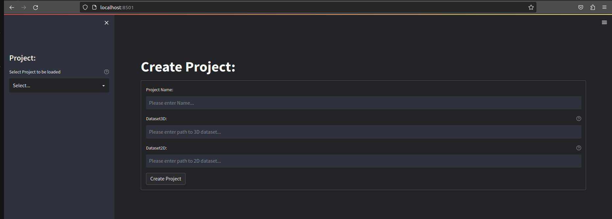
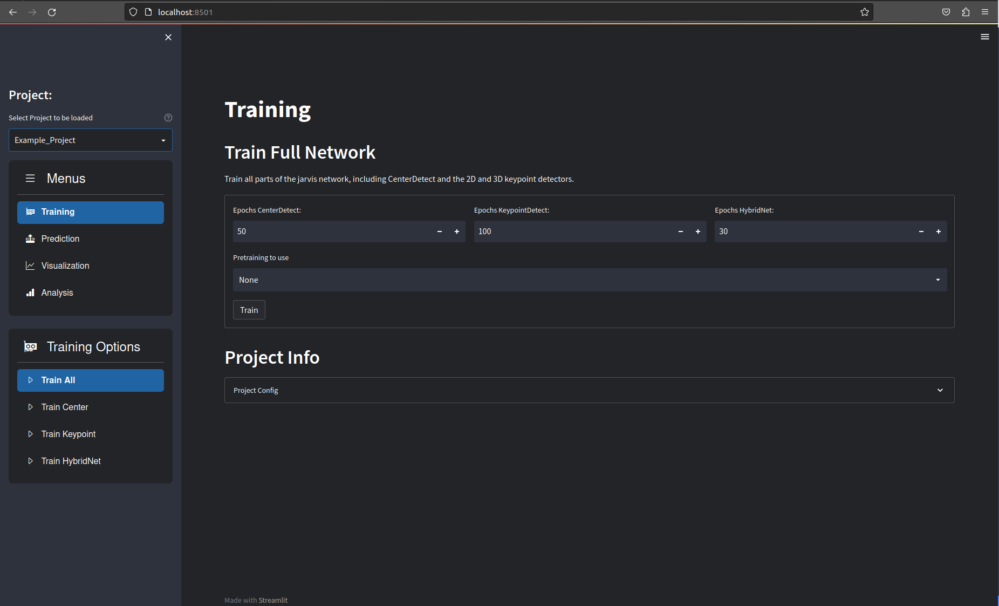
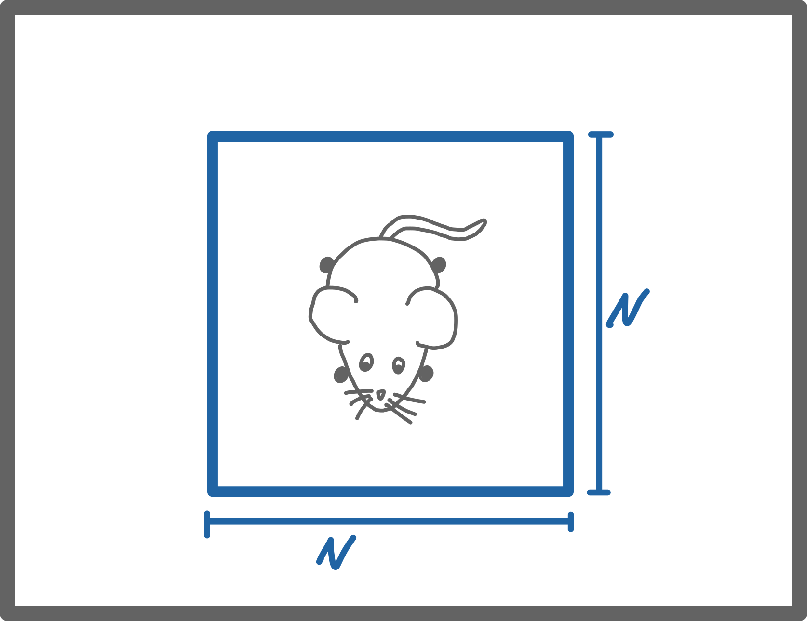
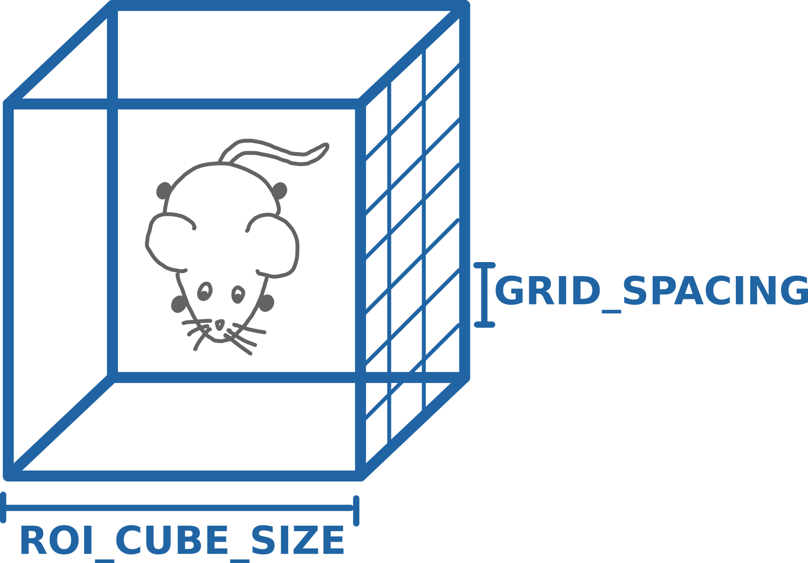

# Training HybridNet

First make sure you have the HybridNet Pytorch Library installed as described in **[this Section](../2_installation_guide)**. 

You should be able to activate the Anaconda environment by running
```
conda activate jarvis
```
and then launch the GUI web-interface with
```
jarvis launch
```
This should open the following window in your browser:

{: .center width="70%"}


From here you have two options:

- <span style="color:#63a31f">Create a new Project</span> by entering a project name and the path to a <span style="color:#63a31f">TrainingSet</span> you have exported with the AnnotationTool (Sorry for the inconsistent naming scheme!). You can use the same path for <span style="color:#63a31f">Dataset3D</span> and <span style="color:#63a31f">Dataset2D</span> for all usual usecases. 
    - To check that everything is created correctly switch to the <span style="color:#63a31f">Visualization Tab</span> and then play around with <span style="color:#63a31f">Visualize Datasset 2D/3D</span> to see that all the markers are in the expected locations and the 3D reconstruction looks reasonable. 
    - New projectes are saved in the <span style="color:#63a31f">projects</span> drirectory in the root <span style="color:#63a31f">JARVIS-Hybridnet</span> directory
- <span style="color:#63a31f">Load an existing Project</span> by selecting it in the dropdown on the right. An example Project is provided to familiarize yourself with the interface.

After either creating or loading a project you should see the following:

{: .center width="70%"}


## Training
The first step after creating your project is training the different neural networks. You have a couple of options here:

- <span style="color:#63a31f">Train All</span>: This trains all parts of the HybridNet architecture in sequence. It is strongly recommended to use this function, with default parameters, to train your networks intially. If this works and you get reasonable results you can use the projects `config.yaml` file to fine tune the parameters if you want to.
- <span style="color:#63a31f">Train Center</span>: Trains the **CenterDetect** network. This is the first step in the tracking pipeline and is used to detect the center of your tracking subject. 
- <span style="color:#63a31f">Train Keypoint</span>: This trains the 2D keypoint detection network. This can be used on its own to detect keypoints in individual images.
- <span style="color:#63a31f">Train HybridNet</span>: This trains the 3D-CNN that is the final stage of the tracking pipeline.
  
!!! warning "Use the three individual training options only if you know what you are doing."

Training will take anywhere from a few minutes to a few hours, depending on your dataset size and hardware. The interface should display updating loss-curves that shoudl look similar to the image below.

<center></center>
{: .center width="70%"}


??? info "Tensorboard logs are saved the `logs` directory for every training run, models are saved in the `models` directory."

## Prediction
The next step is to use your trained networks to predict the poses in one of your recordings. Select the <span style="color:#63a31f">Prediction</span> tab and fill in the following details:

- <span style="color:#63a31f">Path of recording directory</span> is the path of the recording you want to run prediction on.

- <span style="color:#63a31f">Weights for CenterDetect / HybridNet</span> lets you specify which weights you want to use. If you have trained models yourself you can leave them at <span style="color:#63a31f">latest</span>. If you didn't train the network yourself you will have to put the path of the pretrained weights here. They can be found in the <span style="color:#63a31f">pretrained</span> directory inside your <span style="color:#63a31f">JARVIS-Hybridnet</span> folder.

- <span style="color:#63a31f">Start Frame & Number Frames</span> lets you select which part of the recording you want to run the prediction. For quick results set 'Number of Frames' to 1000. To predict until the end of the recording set it to -1.

Once you're done you can run the prediction by clicking the <span style="color:#63a31f">Predict</span> button.\
Once the process is finished you will find a directory with a current timestamp in the projects folder under <span style="color:#63a31f">predictions</span>. That folder contains a 'data3D.csv' file that contains the 3D coordinates and their corresponding confidences for every point in time. The directory also contains a <span style="color:#63a31f">.yaml</span> file that holds some information necessary for creating videos from your predictions.

??? info "Dataset3D file format:"
      - The unit of the entries in the `data3D.csv` is **mm**
      - The reference coordinate frame is relative to your primary camera. 
      - The `confidence` column has a number between 0 and 1, where one presents max. confidence. This metric is pretty flawed, so use carfully.

## Visualization
Navigate to the <span style="color:#63a31f">Visualization</span> tab. Here the correct prediction directory should already be selected. If you want you can remove or add cameras from the list of cameras for which you want to create annotated videos. You can now click <span style="color:#63a31f">Create Video</span> as shown below. If everything is set correctly you should find a directory containing your freshly labeled videos in the project directory after the progress bar is filled up.

## Analysis
If you want to compare the quality of different training runs in more detail the functions inside the <span style="color:#63a31f">Analysis</span> tab are very helpfull.


## Setting the config parameters
Jarvis tries to derive a reasonable set of config parameters by analyzing your trainingset. This is not always perfect though and you will often find yourself modifying the <span style="color:#63a31f">config.yaml</span> inside your project directory. This section aims to describe and illustrate all the non self-explanatory parameters.

``` yaml title="ExampleProject config.yaml"
#General Configuration
DATALOADER_NUM_WORKERS: 4       #Number of threads used for dataloading

#Dataset Configuration
DATASET:
  DATASET_2D: Example_Dataset   #2D dataset path (usually same as DATASET_3D)
  DATASET_3D: Example_Dataset   #3D dataset path

#EfficientTrack 2D Center Detector Configuration:
CENTERDETECT:
  MODEL_SIZE: 'small'           #Can be 'small', 'medium' or 'large'
  BATCH_SIZE: 8                 #Set to 4 for very small datasets (<500 Frames) 
  MAX_LEARNING_RATE: 0.01       #Max learning rate in OneCycle schedule
  NUM_EPOCHS: 50                #Set to 100 for very small datasets
  CHECKPOINT_SAVE_INTERVAL: 10  #Saves a .pth checkpoint ever N epochs
  IMAGE_SIZE: 256               #Frames get resized to NxN

#EfficientTrack 2D Keypoint Detector Configuration
KEYPOINTDETECT:
  MODEL_SIZE: 'small'           #Can be 'small', 'medium' or 'large'
  BATCH_SIZE: 8                 #Set to 4 for very small datasets (<500 Frames) 
  MAX_LEARNING_RATE: 0.01       #Max learning rate in OneCycle schedule
  NUM_EPOCHS: 100               #Set to 200 for very small datasets
  CHECKPOINT_SAVE_INTERVAL: 10  #Saves a .pth checkpoint ever N epochs
  BOUNDING_BOX_SIZE: 256        #Size of the crop around the subject that gets 
                                # fed into KeypointDetect (1)
  NUM_JOINTS: 23                #Number of keypoints (Don't change!)

#hybridNet Configuration
HYBRIDNET:
  BATCH_SIZE: 1                 #Currently only batch size 1 is supported
  MAX_LEARNING_RATE: 0.003      #Max learning rate in OneCycle schedule
  NUM_EPOCHS: 30                #Set to 60 for very small datasets (<500 Frames)
  CHECKPOINT_SAVE_INTERVAL: 10  #Saves a .pth checkpoint ever N epochs
  NUM_CAMERAS: 12               #Number fo cameras (Don't change!)
  ROI_CUBE_SIZE: 144            #Size of the 3D bounding box in mm (2)
  GRID_SPACING: 2               #Resolution of the 3D bounding box in mm 

KEYPOINT_NAMES:                 #List of all keypoint names (for visualization)
- Pinky_T
- Pinky_D
...

SKELETON:                   #List of all joints (for visualization only)
- - Pinky_T
  - Pinky_D
- - Pinky_D
  - Pinky_M
- - Pinky_M
...
 
```

1. {: .center width="100%"}
2. {: .center width="100%"}
